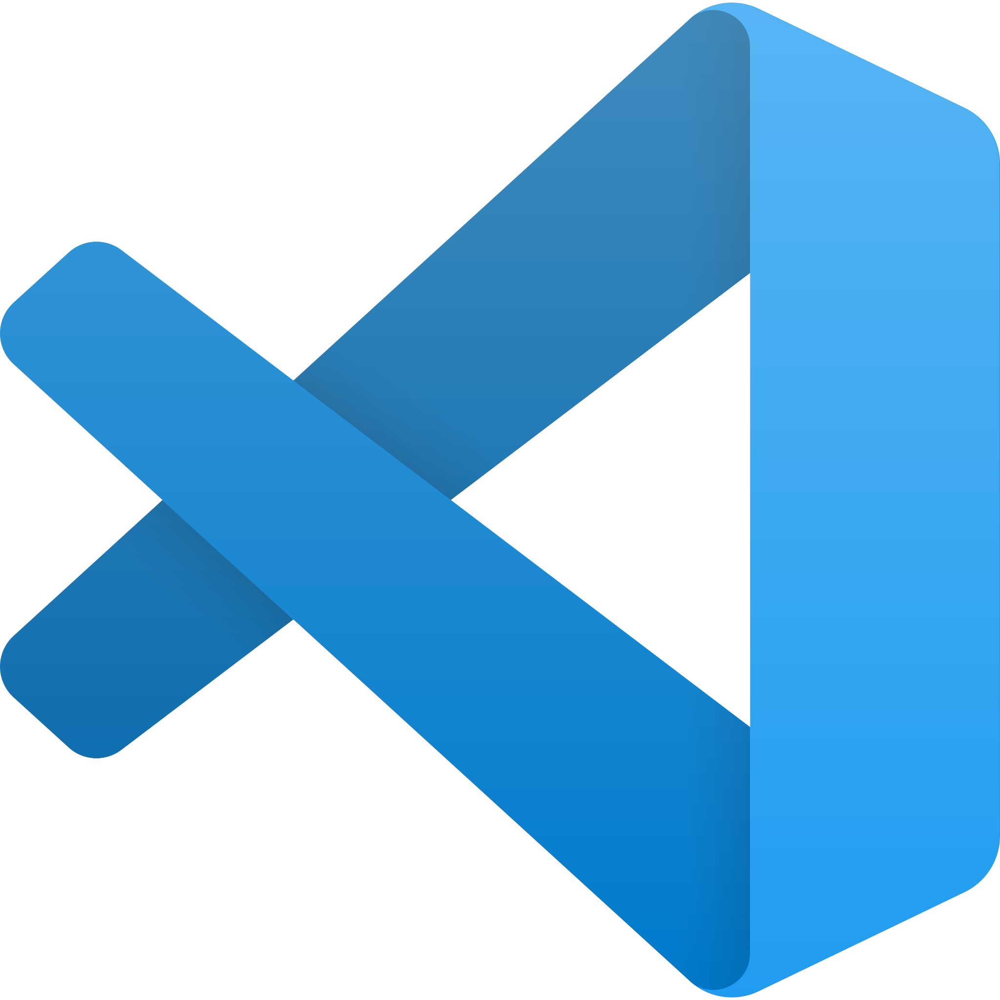

<!-- Headings -->

# Titulo 
## Titulo dos
### MI titulo 3

<!-- Formato -->
<!-- Italic -->
this is an *italic* text
<!-- Bold -->
this is an **strong** text
<!-- Strikethrough -->
esto es un texto tachado ~~tachado~~ 

<!-- Ul -->
* apple
    * apple tow
* orange

<!-- OL  -->
1. Apple
    1. 1 Reloco
2. Orange

<!-- Enlace -->
[youtube.com](https://www.youtube.com/)

[youtube.com](https://www.youtube.com/ "Muestra algo en el holder")

<!-- Cita -->

> This is a quote

---
___

`console.log("Hello world)`

```javascript
// Primero crear el servidor
const express = require ("express");

// Para tener los Websockets
const socketio = require('socket.io'); // LLamo a una clase 


// Modulo HTTP
const http = require("http")


// Instanciando el servidor
const app = express();
// Creando el servidor con el modulo http
const server = http.createServer(app);
// Websockets
const io = socketio(server) // La instancio


io.on("conection" , (socket) => {
    console.log(`Un nuevo usuario conectado` , socket);
});


// Llamo a la carpeta html para que muestre algo
app.use(express.static("public"));

// El server empieza a escuchar
server.listen(3000, () =>{
    console.log("Server On port 3000")
    console.log(typeof(express))
});
```

```python

print("Hola pana")
```
```html
    <h1> Hola pana </h1>
```

<!-- Tablas -->
| titulo1 | titulo 2 | titulo 3|
|---------|----------|---------|
| fila 1  | fila 2   | fila 3
| fila 1  | fila 2   | fila 3
| fila 1  | fila 2   | fila 3

<!-- Imagen -->
<!--  -->


<!-- Githubs markdwon Solo funciona en github -->

* [x] Tarea 1
* [] Tarea 2
* [] Tarea 3
* [x] Tarea 4
